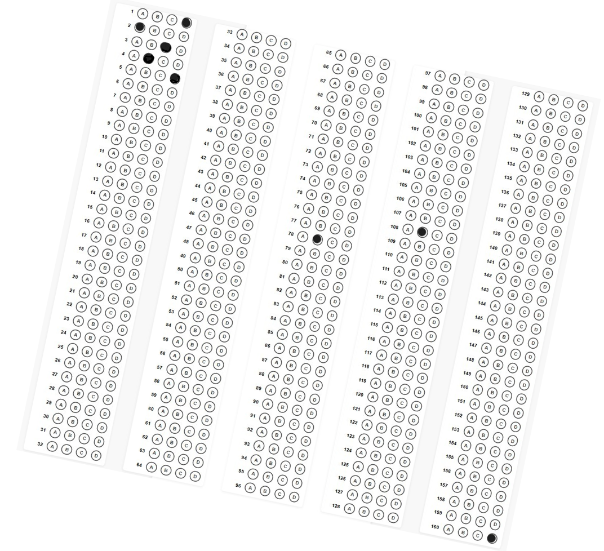
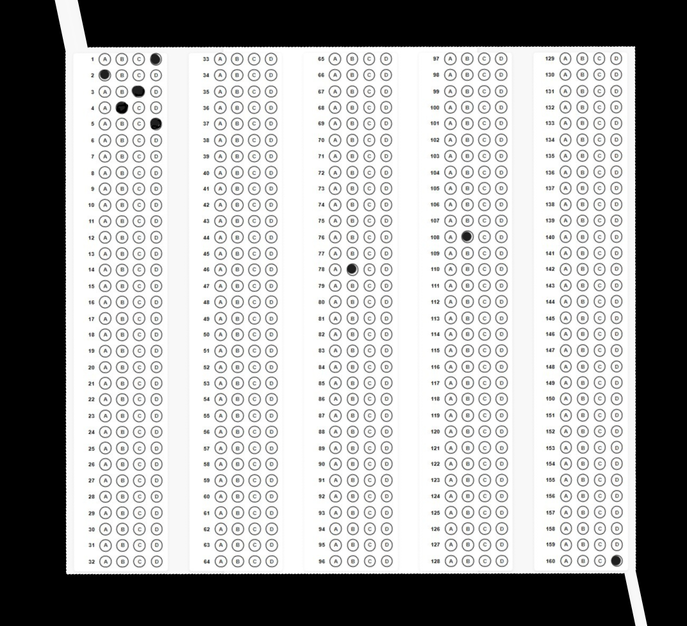
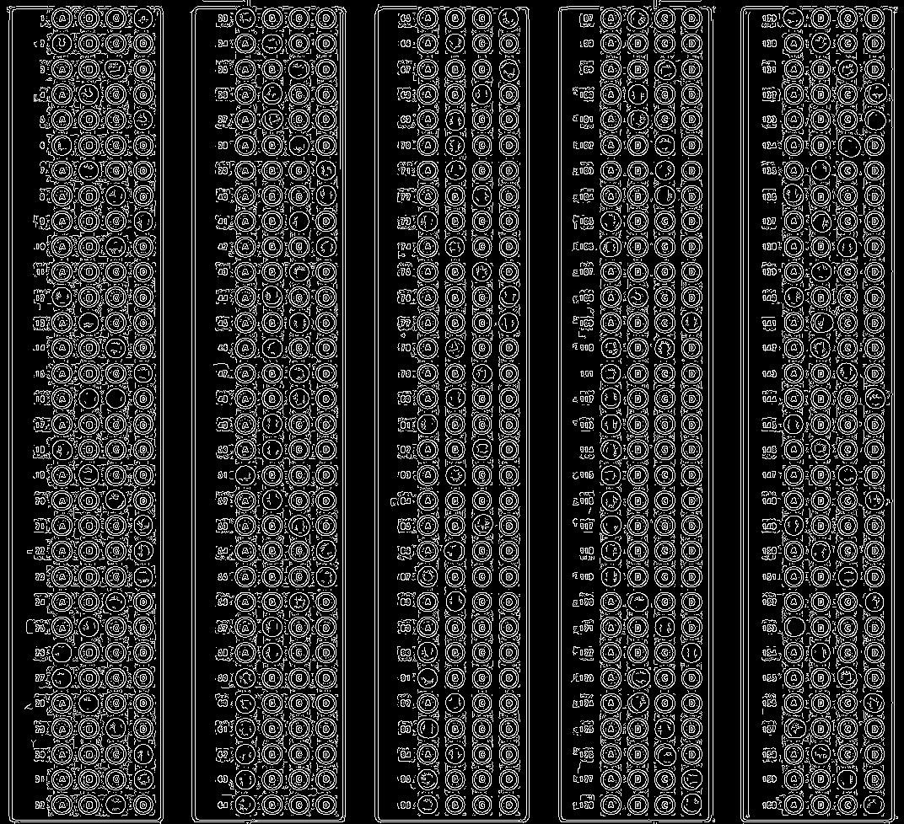
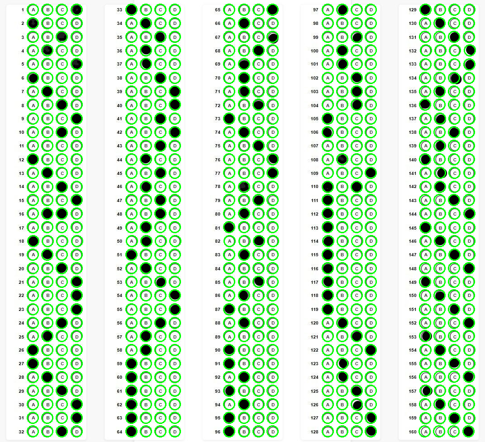
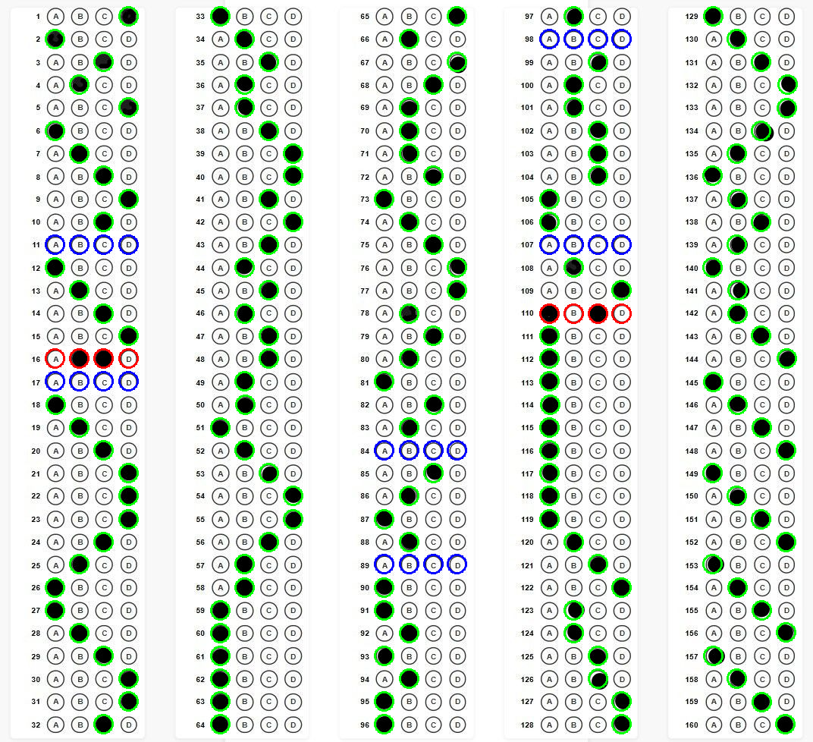

# OMR Sheet Scanner

This project provides a Python-based Optical Mark Recognition (OMR) solution for detecting and extracting responses from bubble-based answer sheets.

## Features

- Aligns and processes OMR sheet images.
- Detects circular bubbles using contour circularity.
- Handles overlapping bubbles in the first row for accurate grid generation.
- Automatically derives total number of questions and options.
- Detects filled answers using threshold-based pixel density analysis.
- Annotates results visually for verification.

## Usage

```bash
python scanner.py <path_to_omr_sheet_image>
```

### Example
```bash
python scanner.py samples/omr_example.png
```

The output will display:
- Annotated image with detected bubbles and selected answers.
- Total number of questions detected.
- Key mapping `{question_number: selected_option}`.

## Screenshots

### Input Image


### Aligned Image


### Edge Detection


### Bubble Detection ( another filled sheet)(image1)


### Final Output with Detected Answers


## Notes

- Alignment works on image edge detection. If there is large rotation with multiple diagonals or misaligned lines, the alignment may fail, causing the scanner to fail as well.  
- Input image should be **high resolution** to allow proper edge detection.  
- Bubbles must be **properly filled**. Improper filling (leaving white gaps) may cause detection errors as incomplete circles are ignored.  
- This is a **general OMR solution**, not bound to a particular sheet design. You can adapt/modify the logic for your preferred OMR sheet format.  
- The scanner **detects all bubbles**. If the sheet contains bubbles for student information or other metadata, the detection may fail. In such cases, crop the image to include only the portion of the answer sheet before passing it to `scanner.py`.  

## Requirements

- Python 3.x
- OpenCV (`cv2`)
- NumPy
- Scipy

Install dependencies:
```bash
pip install opencv-python numpy scipy
```

## Project Structure

- `scanner.py` – Main script for scanning and detecting answers.
- `align.py` – Handles sheet alignment using edge detection.
- `omr_utils.py` – Utility functions for bubble detection, grid generation, and answer evaluation.

